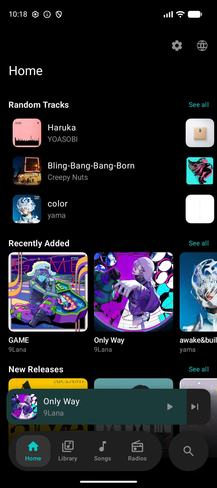
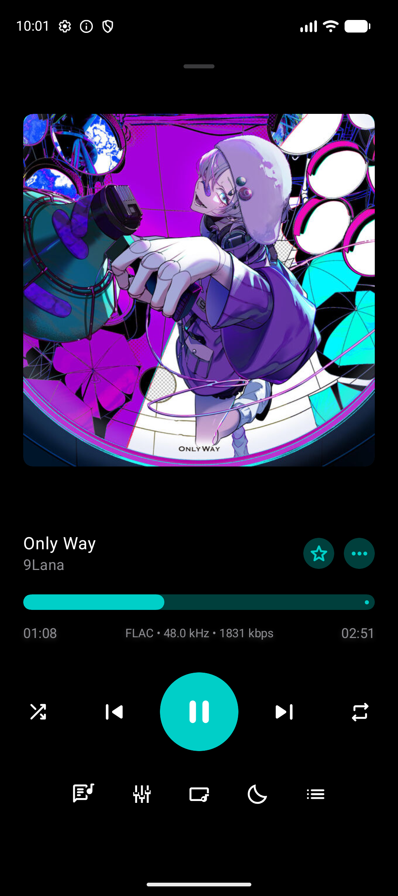
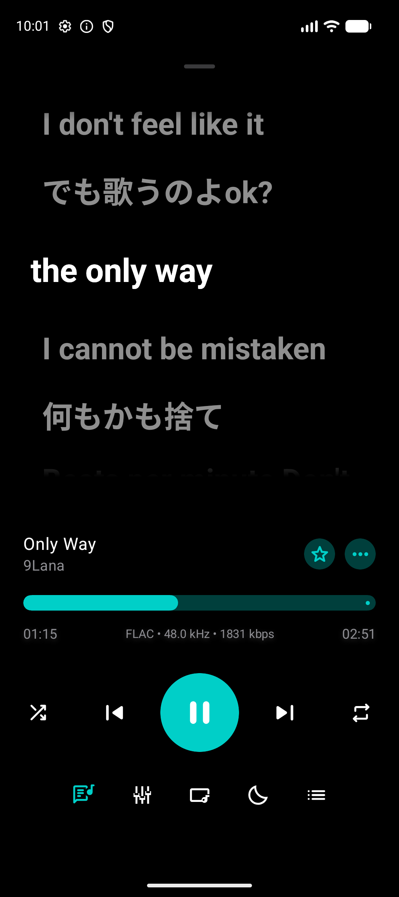
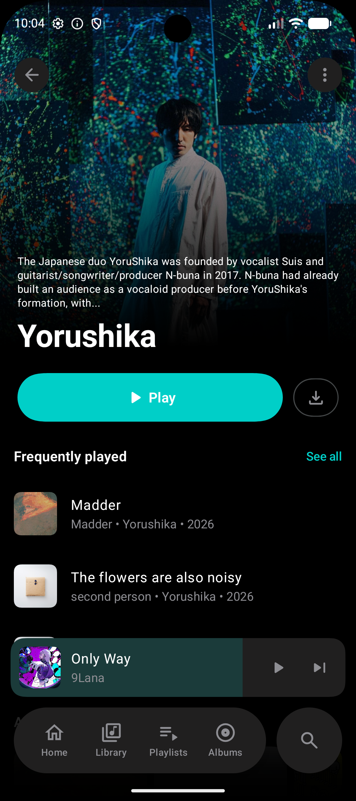
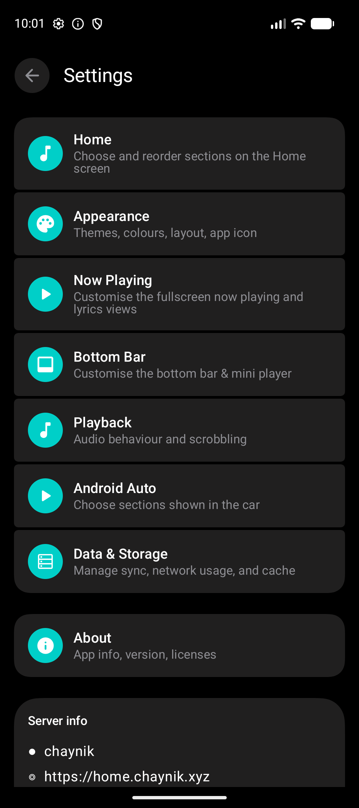

  

<h1 align="center">Mizu</h1>

**A fast, modern and customizable music client for [Navidrome](https://github.com/navidrome/navidrome) and OpenSubsonic-compatible servers.**

Based on **[Navic](https://github.com/ssalggnikool/Navic)**

Mizu is an open-source music player for Android, focused on a clean interface, responsive playback, customization and a great self-hosted music experience.

## Features

* 🎵 Navidrome / OpenSubsonic-compatible server support
* ▶️ Fast and responsive music playback
* 🔀 Queue, shuffle and repeat
* 📝 Synchronized lyrics with tap-to-seek
* 🎚️ Built-in Android equalizer
* 📡 Cast support
* 📺 DLNA / UPnP playback
* 🚗 Android Auto support
* 📥 Music downloads and offline playback
* ⚡ Pre-buffering for smoother track transitions
* 🎨 Material You dynamic colors (Android 12+)
* 🖌️ Multiple built-in Mizu color styles
* 📱 Adaptive launcher icon with multiple note styles
* ⏱️ Sleep timer
* 🎧 Audio Offload support
* 📊 Scrobbling support
* 🌍 Extensive localization
* ↔️ Full RTL support, including Arabic and Hebrew

## Screenshots

  
  
  
  
  

  Home · Now Playing · Lyrics · Artist Page · Settings

## Languages

Mizu includes localization support for:

Arabic, Belarusian, Bengali, Chinese (Simplified), Dutch, English, French, German, German (Switzerland), Hebrew, Hindi, Indonesian, Italian, Japanese, Kazakh, Korean, Norwegian Bokmål, Polish, Portuguese, Portuguese (Brazil), Russian, Spanish, Turkish, Ukrainian and Vietnamese.

Some regional locales use Android's standard locale fallback where appropriate.

Translations are continuously reviewed and improvements are welcome.

## Server Compatibility

Mizu is designed primarily for **[Navidrome](https://github.com/navidrome/navidrome)** and uses the OpenSubsonic/Subsonic ecosystem.

Compatibility with other OpenSubsonic-compatible servers may vary.

## Customization

Mizu is designed to feel at home on Android while still letting you make it yours.

You can customize:

* Application color style
* Material You dynamic colors (Android 12+)
* Light / dark appearance
* Launcher icon style
* Player appearance

Material You and launcher icon customization are independent, so you can use Android system colors without giving up your preferred Mizu icon.

## Contributing

Contributions are welcome.

If you find a bug, have an idea, want to improve a translation or would like to contribute code, feel free to open an Issue or Pull Request.

Before making large architectural changes, please open an Issue first so the approach can be discussed.

## Bug Reports

When reporting a playback-related bug, please include, when possible:

* Android version
* Device model
* Mizu version
* Server and server version
* Steps to reproduce
* Whether the issue occurs consistently
* Relevant logs without passwords, tokens or authenticated URLs

For UI and localization issues, screenshots are especially helpful.

## Roadmap

Mizu 1.0 focuses on delivering a stable, fast and polished music experience.

Future development will focus on improving Mizu while keeping it fast, simple and easy to contribute to.

Planned improvements include:

* More modular architecture
* Plugin and extension support
* More lyrics and metadata providers
* Performance and memory optimizations
* Better caching and offline playback
* Advanced download manager
* Playback improvements
* Improved Android Auto support
* Cast, DLNA and UPnP improvements
* More customization options
* Accessibility improvements
* More languages and localization improvements
* Better documentation for contributors

> The roadmap may change as Mizu evolves.

## Credits

Mizu is based on **[Navic](https://github.com/ssalggnikool/Navic)** and builds upon the work of its original developers and contributors.

The project has since been expanded with additional playback functionality, customization, casting, equalizer support, Android Auto integration, localization improvements and other features.

See [ACKNOWLEDGEMENTS.md](ACKNOWLEDGEMENTS.md) for additional attribution and project history.

## License

Mizu is free and open-source software licensed under the **GNU General Public License v3.0 (GPL-3.0)**.

See [LICENSE](LICENSE) for the full license text.
